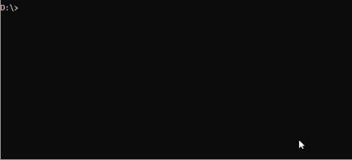

# Quick App Generator CLI

Handy CLI to create [Huawei Quick Apps](https://developer.huawei.com/consumer/en/quickApp) from H5 by using command line easily.

Set up a modern installation-free app from any web url by running only one command.



## Usage

1. To create single QuickApp:

```sh
npm install -g @onurkenis/create-quick-app   # install globally once
create-quick-app                             # run from anywhere

npx @onurkenis/create-quick-app              # run via npx without installing
```

2. Batch application creation from json.

```sh
npm install -g @onurkenis/create-quick-app               # install globally once
create-quick-app --fromJson=path_of_json                 # run from anywhere

npx @onurkenis/create-quick-app --fromJson=path_of_json  # run via npx without installing 
```

3. To get rpk file, do followings and check `PROJECT_PATH/dist` folder.

```sh
cd PROJECT_PATH
npm install
npm run release
```

## Options

All options can be empty when running the create-quick-app. Missing fields will be asked respectively.
_Note: batch creation is only available in-line._

```js
const args = {
  '--appName': String,      // name of your application
  '--packageName': String,  // package name of your application
  '--url': String,          // url to render in app
  '--icon': String,         // path of app icon. default icon will be used if this field is empty
};
```

```sh
npx @onurkenis/create-quick-app
    --appName="My App"
    --packageName=com.onurkenis.myApp
    --url=https://github.com/onurkenis/create-quick-app
    --icon=./icon.png
```

#### Json Format

```json
{
  "projects": [
    {
      "appName": "TestApp1",
      "packageName": "com.onurkenis.one",
      "url": "https://github.com/onurkenis/create-quick-app",
      "icon": "C:/Pictures/optional_icon.jpg"
    },
    {
      "appName": "TestApp2",
      "packageName": "com.onurkenis.two",
      "url": "https://github.com/onurkenis/create-quick-app"
    },
    {
      "appName": "TestApp3",
      "packageName": "com.onurkenis.three",
      "url": "https://github.com/onurkenis/create-quick-app"
    }
  ]
}
```
_limitation: If there is more than one application with the same package name in JSON, last one overrides others._


## Contributing

Commit messages must comply with [conventional commits](https://www.conventionalcommits.org).
